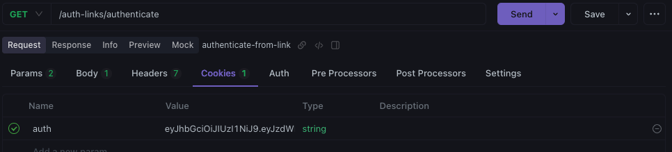

## 🍕 Pizza Shop API - Gerenciando seu Império de Pizza 🍕

**Construa seu império de pizza com a API Pizza Shop, uma solução completa para gerenciar pedidos, analisar dados e otimizar suas operações.**

**Recursos:**

* **Gerenciamento de Pedidos Completo:** Crie, gerencie, aprovê, despache, entregue e cancele pedidos com facilidade.
* **Análise de Dados Detalhada:** Acompanhe a receita mensal, o recebimento diário, a quantidade de pedidos, os produtos mais populares e muito mais!
* **Interface Intuitiva:** Uma API RESTful bem documentada para uma integração simples e eficiente com seus aplicativos.
* **Segurança Robusta:** Autenticação de usuários com segurança para proteger seus dados.
* **Código Limpo e Eficiente:** Construída com Bun e ElysiaJS, garantindo desempenho e confiabilidade.

**Tecnologias:**

* **Bun:** Runtime rápido e eficiente, baseado no JSCore do Safari.
* **ElysiaJS:** Framework leve e poderoso para construir APIs RESTful com Bun.
* **Drizzle-ORM:** ORM (Object-Relational Mapper) para PostgreSQL, simplificando a interação com o banco de dados.
* **PostgreSQL:** Sistema gerenciador de banco de dados relacional (RDBMS) robusto e popular.
* **Open API:** Especificação para definir e documentar a API, garantindo clareza e consistência.
* **Zod:** Biblioteca de validação de tipos para TypeScript, garantindo a integridade dos dados.
* **Dayjs:** Biblioteca para manipulação de datas e horas, facilitando a formatação e cálculos.
* **Nodemailer:** Biblioteca para envio de emails, utilizada para autenticação e outros propósitos.
* **Cuid2:** Biblioteca para geração de IDs únicos.
* **Chalk:** Biblioteca para formatação de texto em console, melhorando a legibilidade de logs.

**Começando:**

1. **Clone o Repositório:**

   ```bash
   git clone https://github.com/diogomfc/api-pizza-shop.git
   ```

2. **Instale as Dependências:**

   ```bash
   bun install
   ```

3. **Inicie o Servidor:**

   ```bash
   bun dev
   ```

**Autenticação:**

* **`/authenticate` (POST):** Envie um email para receber um link de autenticação. (Email de teste: `admin@admin.com`)
* **`/auth-links/authenticate` (GET):** Autentique-se com o link de autenticação e copie o token gerado para usar nas rotas protegidas.

**Imagens da Autenticação:**

* **Link de Autenticação:** [](git/image-1.png)
* **Token de Autenticação:** [](git/image.png)

**Rotas:**

**Usuário:**

* **`/me` (GET):** Retorna informações do usuário autenticado.

**Restaurantes:**

* **`/restaurantes` (POST):** Registra um novo restaurante.

**Pedidos:**

* **`/orders/{orderId}` (GET):** Retorna detalhes de um pedido específico.
* **`/orders/{orderId}/approve` (PATCH):** Aprova um pedido.
* **`/orders/{orderId}/dispatch` (PATCH):** Despacha um pedido.
* **`/orders/{orderId}/deliver` (PATCH):** Entrega um pedido.
* **`/orders/{orderId}/cancel` (PATCH):** Cancela um pedido.
* **`/orders` (GET):** Retorna uma lista de pedidos com paginação.

**Métricas:**

* **`/metrics/month-revenue` (GET):** Retorna a receita mensal.
* **`/metrics/daily-receipt-in-period` (GET):** Retorna o recebimento diário em um período específico.
* **`/metrics/day-orders-amount` (GET):** Retorna a quantidade de pedidos por dia.
* **`/metrics/month-orders-amount` (GET):** Retorna a quantidade de pedidos por mês.
* **`/metrics/month-canceled-orders-amount` (GET):** Retorna a quantidade de pedidos cancelados por mês.
* **`/metrics/popular-products` (GET):** Retorna os produtos mais populares.

**Gerenciamento de Restaurantes:**

* **`/managed-restaurante` (GET):** Retorna informações sobre o restaurante gerenciado pelo usuário.

**Documentação:**

* A documentação completa da API está disponível no arquivo `openapi.json`.

**Licença:**

* Este projeto está licenciado sob a licença MIT.


